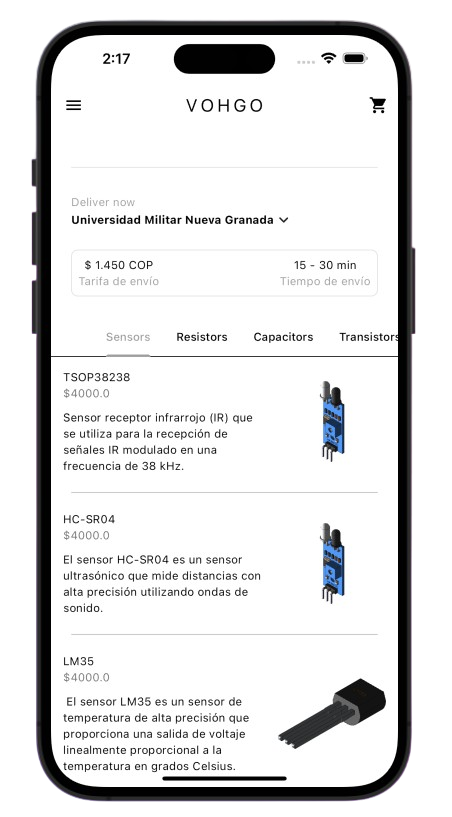
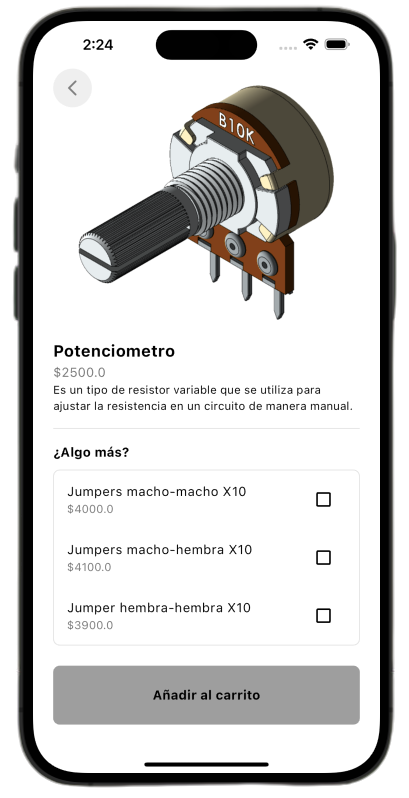
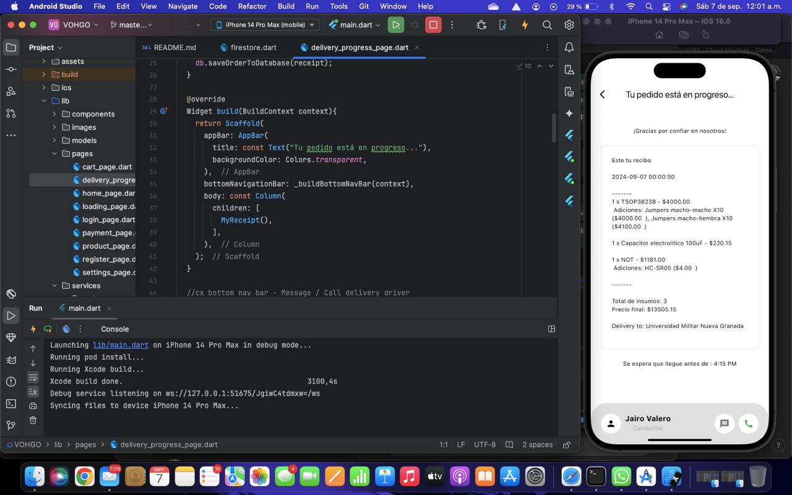

# VOHGO

App disponible in IOS y Android para compra y venta de componentes electrónicos, de construcción y papelería.
<p align="center">
  
</p>


## Tabla de Contenidos

1. [Descripción](#descripción)
2. [Uso](#uso)
3. [Características](#características)
6. [Contacto](#contacto)
7. [Instalación](#instalación)

## Descripción

Estudiantes de carreras técnicas suelen tener laboratorios o proyectos, los cuales, usualemente se llevan a cabo con materiales que se consiguen en el centro de la ciudad (Bogotá), el cual suele ser lejos en muchas de las universidades y los estudiantes pierden laboratorios porque se les quema 1 sensor que no cuesta más de 1 dólar aveces y no tienen tiempo de ir a comprarlo o es muy tarde en la noche.

<p align="center">
  
</p>

VOHGO soluciona este problema, dándoles acceso a todo un mercado de componentes e insumos 24/7. Por otro lado, se le brinda un SaaS (que puedes ojear haciendo click aquí) a los comercios del centro de la ciudad para recibir las órdenes.

<p align="center">
  
</p>

## Uso
VOHGO está disponible en IOS y Andriod para su descarga, su operación está en Bogotá, centrada en el Barrio chicó.

## Características
VOHGO fue desarrollada en flutter para facilitar y reducir el tiempo de la producción para multiplataforma, utiliza firebase como administrador de usuarios y también para la recepción de órdenes en una base de datos, veamos un ejemplo:

1. El usuario agrega sus productos al carrito:
<p align="center">
  
</p>

2. Genera la orden y se le entrega un recibo y asigna un repartidor:
<p align="center">
  
</p>

3. Llega a la base de datos:
<p align="center">
  
</p>


## Contacto
Mi nombre es David Espejo y desarrollé el app:

¡Estoy siempre disponible para colaborar y discutir ideas interesantes! Puedes encontrarme en las siguientes plataformas:

[](https://www.linkedin.com/in/david-alejandro-espejo-garcia-298808216/) 
[](https://x.com/DavidEs91503087)
[](https://github.com/Davases22)
[](https://www.instagram.com/davases22/)
[](https://www.youtube.com/@davasplayg2802)

## Contacto

Si quieres hablar sobre tecnología, startups o simplemente saludar, ¡no dudes en enviarme un mensaje!  
📧 Email: [davas.espejo@gmail.com](mailto:davas.espejo@gmail.com)


## Instalación

Sigue los siguientes pasos para clonar el repositorio y ejecutar el proyecto localmente si deseas inspirarte para un proyecto similar, usa Xcode si deseas ver la versión IOS o Andriod Studio para la versión Android

```bash
# Clonar el repositorio
git clone https://github.com/Davases22/VOHGO 

# Navegar al directorio del proyecto
cd VOHGO

# Instalar dependencias
flutter pub get

# Ejecutar el proyecto
flutter run
```

